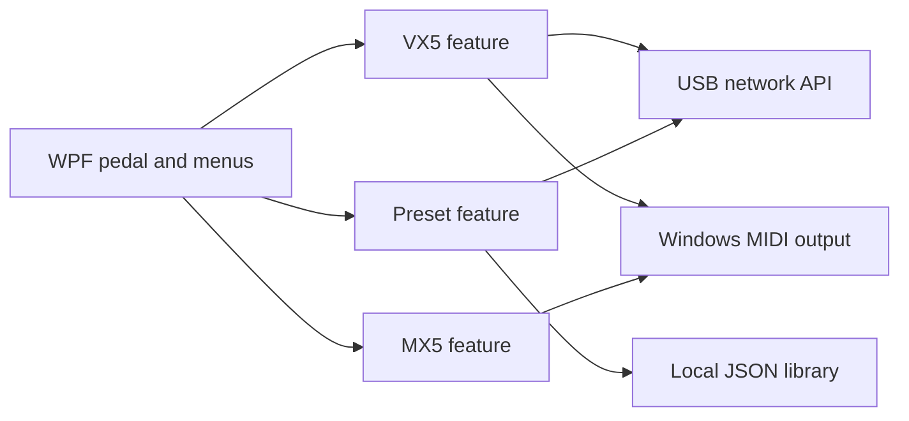

# Architecture

The desktop app is a WPF window loaded from XAML. `Controller` is split across partial classes by feature. This keeps the current no download build working while isolating device behavior from each feature's UI handlers.

The VX5 publishes a state tree and property metadata through its local USB network service. The app loads metadata and values, builds the Advanced editor from the metadata, and writes changed properties through HTTP PUT. A GET after each edit updates the UI from device state. VX5 preset selection, A/B, and Talk use Windows MIDI output. The MX5 module currently uses documented MIDI commands and awaits hardware verification.

Preset names and snapshots belong to the PC library. Factory names come from the VX5 guide. The device has not exposed a preset name, save, or snapshot endpoint over its USB API. The app therefore distinguishes live parameter editing from permanent device storage.

The next structural improvement is a standalone device service behind `Controller`, followed by view models and asynchronous I/O. This is especially useful before adding more devices or background polling; the current synchronous API calls can block the UI for the configured timeout if the VX5 disconnects.
